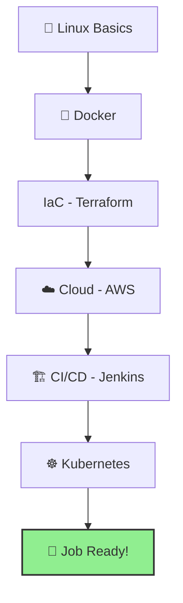

# 🚀 Cloud DevOps Interview Preparation Kit

> [!IMPORTANT]
> **Total Success Rate**: This repository is designed to help you ace your DevOps interviews by simplifying complex concepts and providing production-grade examples.

Welcome to the ultimate guide for Cloud DevOps interview preparation. This repo follows the **"Explain like I'm 5"** philosophy while maintaining **Infra360** industry standards.

---

## 🗺 Interactive Roadmap

---

## 📂 Navigation Table

| Topic | Key Focus Areas | Level |
| :--- | :--- | :--- |
| [🐧 **Linux**](./linux/README.md) | Architecture, File System, Commands | Beginner |
| [🐳 **Docker**](./docker/README.md) | Architecture, Dockerfile, Security | Intermediate |
| [☸️ **Kubernetes**](./kubernetes/README.md) | K8s Flows, Deployment Strategies, Storage | Advanced |
| [🌍 **Terraform**](./terraform/README.md) | Lifecycle, State, HCL, Modules | Intermediate |
| [☁️ **AWS Cloud**](./aws/README.md) | VPC, Load Balancers, IAM, RDS | Intermediate |
| [🏗 **Jenkins**](./jenkins/README.md) | Declarative Pipelines, CI/CD Flow | Intermediate |
| [🛠 **Build Tools**](./build-tools/README.md) | Maven, NPM, Build Lifecycle | Beginner |
| [🧪 **DevOps Tools**](./devops-tools/README.md) | SonarQube, Nexus, Trivy | Beginner |

---

## ✨ Repository Features
- **Visual Learning**: High-quality Mermaid diagrams for every complex flow.
- **Embedded POCs**: Real-world code examples directly inside the READMEs.
- **Troubleshooting**: Common failure points and how to fix them.
- **Scenario Questions**: Real interview questions with expert answers.
- **Zero Placeholders**: No "TODO"s. Everything is production-ready.

---

> [!TIP]
> **Pro Interview Tip**: When answering questions, always refer to a real-world scenario you've worked on. Use this repo to build that mental framework!

