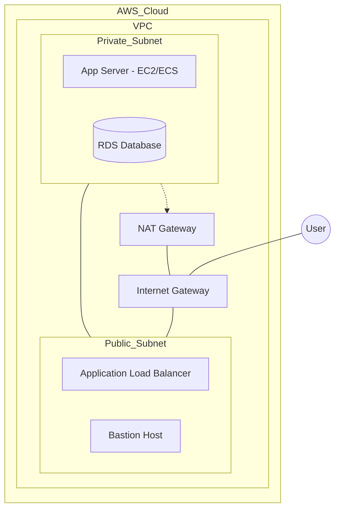
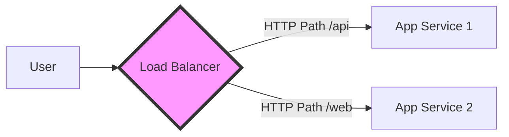

# AWS for Cloud DevOps Engineers

AWS (Amazon Web Services) is the most widely used cloud platform. It provides over 200 services. Here we cover the essentials for DevOps engineers.

## 🏗 VPC (Virtual Private Cloud) Architecture

A VPC is your own private network in the cloud.

- **Subnets**: A range of IP addresses in your VPC.
    - **Public Subnet**: Has a route to an Internet Gateway (IGW). Used for ALBs, Bastion hosts.
    - **Private Subnet**: No direct route to the internet. Used for DBs, App servers.
- **Bastion Host**: A small EC2 instance in a public subnet used to SSH into instances in private subnets.
- **NAT Gateway**: Allows instances in a private subnet to connect to the internet (for updates) but prevents the internet from initiating a connection with those instances.

## ⚖️ Load Balancers (ALB vs NLB vs GLB)

| Feature | ALB (Layer 7) | NLB (Layer 4) | GLB (Layer 3) |
|---------|---------------|---------------|---------------|
| **Protocols** | HTTP, HTTPS, gRPC | TCP, UDP, TLS | IP |
| **Use Case** | Web applications, Microservices | Extreme performance, Static IPs | Network appliances (Firewalls) |
| **Routing** | Path-based, Host-based | IP address based | Direct IP routing |

## 📦 Key AWS Services

- **EC2**: Virtual servers in the cloud.
- **ECS**: Container orchestration service (Docker).
- **EKS**: Managed Kubernetes service.
- **S3**: Object storage (unlimited space for files).
- **RDS**: Managed Relational Database (MySQL, PostgreSQL, etc.).
- **CloudWatch**: Monitoring and logging.
- **Route53**: Domain Name System (DNS) web service.
- **ECR**: Docker container registry.
- **IAM**: Identity and Access Management (Users, Roles, Policies).

## 💡 Scenario Based Questions

**Q1: How do you secure a database in AWS?**
- **Ans**: Place the DB in a **Private Subnet**. Use **Security Groups** to allow traffic only from the Application Server's Security Group on the specific port (e.g., 3306). Use **IAM roles** for authentication and enable **encryption at rest** (KMS).

**Q2: What is the difference between a Security Group and a Network ACL?**
- **Ans**:
    - **Security Group**: Operates at the **Instance level**. Stateful (if you allow inbound, outbound is automatically allowed). Only supports "Allow" rules.
    - **NACL**: Operates at the **Subnet level**. Stateless (you must explicitly allow both inbound and outbound). Supports "Allow" and "Deny" rules.

**Q3: How do you avoid the "Single Point of Failure" for your application?**
- **Ans**: Deploy instances in multiple **Availability Zones (AZs)** behind an **Auto Scaling Group** and an **Application Load Balancer**.

**Q4: Which service should you use to store frequently accessed configurations?**
- **Ans**: **AWS Systems Manager Parameter Store** or **AWS Secrets Manager** (for sensitive data like DB passwords).

**Q5: What is S3 Versioning and why would you use it?**
- **Ans**: It allows you to keep multiple versions of an object in a bucket. It helps recover from accidental deletions or overwrites.
