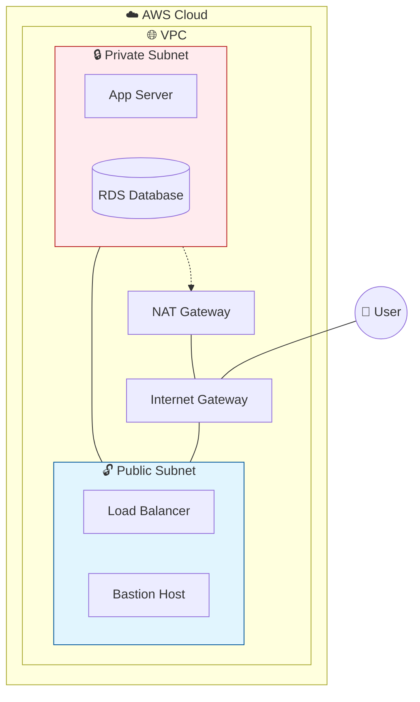

# ☁️ AWS for Cloud DevOps Engineers

> [!NOTE]
> AWS (Amazon Web Services) is the most widely used cloud platform. It provides over 200 services. Here we cover the essentials for DevOps engineers.

## 🏗 VPC (Virtual Private Cloud) Architecture

---

## ⚖️ Load Balancers (ALB vs NLB vs GLB)

| Feature | ALB (Layer 7) | NLB (Layer 4) | GLB (Layer 3) |
| :--- | :--- | :--- | :--- |
| **Protocols** | HTTP, HTTPS, gRPC | TCP, UDP, TLS | IP |
| **Use Case** | Web Apps, Microservices | Extreme performance | Network appliances |
| **Routing** | Path/Host-based | IP address based | Direct IP routing |

---

## 💡 Scenario Based Questions

> [!IMPORTANT]
> **Q: How do you secure a database in AWS?**
> **Ans:** 1. Place the DB in a **Private Subnet**. 2. Use **Security Groups** to allow traffic only from the App Server. 3. Enable **Encryption at Rest** (KMS).

> [!WARNING]
> **Q: Security Group vs Network ACL (NACL)?**
> **Ans:** **Security Group** is at the **Instance level** and is **Stateful**. **NACL** is at the **Subnet level** and is **Stateless** (requires explicit allow for both ways).

> [!TIP]
> **Q: How to handle high availability in AWS?**
> **Ans:** Deploy instances in **Multiple Availability Zones (Multi-AZ)** and use an **Auto Scaling Group** with a **Load Balancer**.

