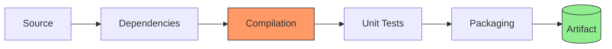

# 🛠 Build Tools for Cloud DevOps Engineers

> [!NOTE]
> Build tools automate the process of converting source code into an executable application. They manage dependencies, compilation, and packaging.

## ⚙️ The Build Lifecycle



---

## 🛠 Hands-on Proof of Concepts (POCs)

### 1. Maven (`pom.xml`) - Java
```xml
<project>
    <modelVersion>4.0.0</modelVersion>
    <groupId>com.example</groupId>
    <artifactId>my-app</artifactId>
    <version>1.0-SNAPSHOT</version>

    <dependencies>
        <dependency>
            <groupId>junit</groupId>
            <artifactId>junit</artifactId>
            <version>4.13.2</version>
            <scope>test</scope>
        </dependency>
    </dependencies>
</project>
```

### 2. NPM (`package.json`) - Node.js
```json
{
  "name": "my-app",
  "version": "1.0.0",
  "scripts": {
    "start": "node app.js",
    "test": "mocha",
    "build": "webpack"
  },
  "dependencies": {
    "express": "^4.18.2"
  }
}
```

---

## 💡 Scenario Based Questions

> [!TIP]
> **Q: Difference between `npm install` and `npm ci`?**
> **Ans:** `npm install` can update your `package-lock.json`. `npm ci` (Clean Install) is strictly for CI/CD environments as it only installs from the lock file, ensuring a predictable build.

> [!IMPORTANT]
> **Q: How to handle dependency conflicts in Maven?**
> **Ans:** Use `mvn dependency:tree` to identify the hierarchy of transitive dependencies. Use the `<exclusions>` tag in your `pom.xml` to remove unwanted versions.

> [!WARNING]
> **Q: What is a "Snapshot" version in Maven?**
> **Ans:** A `SNAPSHOT` is a development version that is not yet released. Unlike regular versions, Maven will always check the remote repository for a newer version of a snapshot during every build.

