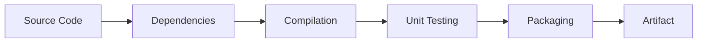

# Build Tools for Cloud DevOps Engineers

Build tools automate the process of converting source code into an executable application.

## 🛠 Popular Build Tools

### 1. Maven (Java)
Maven uses a `pom.xml` file to manage dependencies and the build lifecycle.
- **Key Commands**:
    - `mvn clean`: Removes the target folder.
    - `mvn compile`: Compiles the source code.
    - `mvn test`: Runs unit tests.
    - `mvn package`: Creates a `.jar` or `.war` file.
    - `mvn install`: Installs the package into the local repository.

### 2. NPM (Node.js)
NPM (Node Package Manager) uses `package.json` to manage dependencies.
- **Key Commands**:
    - `npm install`: Installs dependencies.
    - `npm run build`: Runs the build script defined in `package.json`.
    - `npm test`: Runs tests.

### 3. MSBuild (.NET)
MSBuild is the build engine for .NET.
- **Key Commands**:
    - `msbuild app.csproj /t:Build`: Builds the project.

## ⚙️ The Build Lifecycle

## 💡 Scenario Based Questions

**Q1: What is the purpose of `pom.xml` in Maven?**
- **Ans**: It is the "Project Object Model" file. It contains information about the project and configuration details used by Maven to build the project, such as dependencies, plugins, and goals.

**Q2: What is the difference between `npm install` and `npm ci`?**
- **Ans**: `npm install` can update `package-lock.json`. `npm ci` (Clean Install) is used in CI/CD environments as it strictly installs from the `package-lock.json` and crashes if there's a mismatch, ensuring a predictable build.

**Q3: How do you handle a "Dependency Hell" in Maven?**
- **Ans**: Use the `mvn dependency:tree` command to see the hierarchy of dependencies and identify conflicts. You can use the `<exclusions>` tag in `pom.xml` to remove unwanted transitive dependencies.
