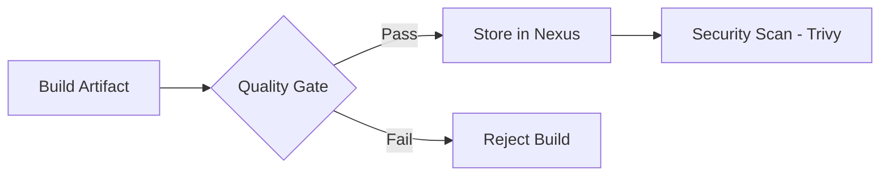

# DevOps Tools: SonarQube, Nexus, and Trivy

These tools are essential for maintaining code quality, managing artifacts, and ensuring security in a CI/CD pipeline.

## 🔍 SonarQube (Static Code Analysis)

SonarQube scans your code to find bugs, vulnerabilities, and code smells.

- **Quality Gate**: A set of conditions that a project must meet to pass (e.g., Code Coverage > 80%).
- **Key Metrics**: Reliability, Security, Maintainability, Duplications.

## 📦 Nexus Artifactory (Artifact Management)

Nexus is a repository manager that allows you to store and organize your build artifacts (JARs, Docker Images, NPM packages).

- **Proxy Repository**: Proxies an external repository (like Maven Central) to save bandwidth.
- **Hosted Repository**: Where you store your own internal artifacts.

## 🛡 Trivy (Vulnerability Scanning)

Trivy is a simple and comprehensive vulnerability scanner for containers and other artifacts.

- **Vulnerability Scan**: Detects CVEs (Common Vulnerabilities and Exposures).
- **Misconfiguration Scan**: Detects issues in IaC templates (Terraform, Dockerfile, etc.).

## 💡 Scenario Based Questions

**Q1: Why do we use SonarQube in a CI/CD pipeline?**
- **Ans**: It ensures that only high-quality code reaches production by automatically identifying technical debt and security vulnerabilities early in the development cycle.

**Q2: What is an Artifact?**
- **Ans**: An artifact is any file produced during the build process, such as a `.jar` file, a `.war` file, or a Docker Image.

**Q3: Why not just store artifacts in Git?**
- **Ans**: Git is designed for source code, not large binary files. Binary files slow down Git operations. Nexus or Artifactory are optimized for storing and retrieving large binaries efficiently.

**Q4: How do you integrate Trivy into a Jenkins pipeline?**
- **Ans**: You can run Trivy as a shell command in one of the pipeline stages. If a "Critical" vulnerability is found, you can configure the stage to fail, stopping the deployment.
