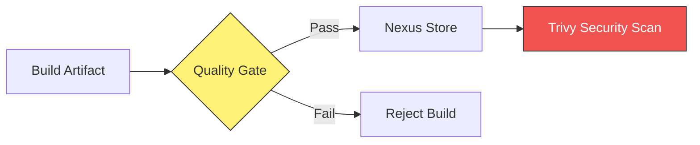

# 🧪 DevOps Tools: SonarQube, Nexus, and Trivy

> [!NOTE]
> These tools are essential for maintaining code quality, managing artifacts, and ensuring security in a high-speed CI/CD pipeline.

## 🔍 The Quality & Security Gate

---

### Tool Overview
| Tool | Category | Primary Function |
| :--- | :--- | :--- |
| **SonarQube** | Static Analysis | Finds bugs, vulnerabilities, and code smells. |
| **Nexus** | Artifactory | Stores and organizes build binaries (JAR, Docker). |
| **Trivy** | Security | Scans images and IaC for CVEs. |

---

## 💡 Scenario Based Questions

> [!IMPORTANT]
> **Q: Why use Nexus instead of just storing binaries in Git?**
> **Ans:** Git is for source code. Storing large binary artifacts in Git bloats the repository size and slows down performance. Nexus is optimized for binary storage and versioning.

> [!WARNING]
> **Q: What is a "Quality Gate" in SonarQube?**
> **Ans:** A set of conditions (e.g., "Must have >80% code coverage") that a project must meet to pass. If it fails, the CI/CD pipeline stops immediately.

> [!TIP]
> **Q: How to integrate Trivy into Jenkins?**
> **Ans:** Run Trivy as a shell command after the Docker build. Configure it to return a non-zero exit code if it finds `CRITICAL` issues, which will fail the Jenkins job.

