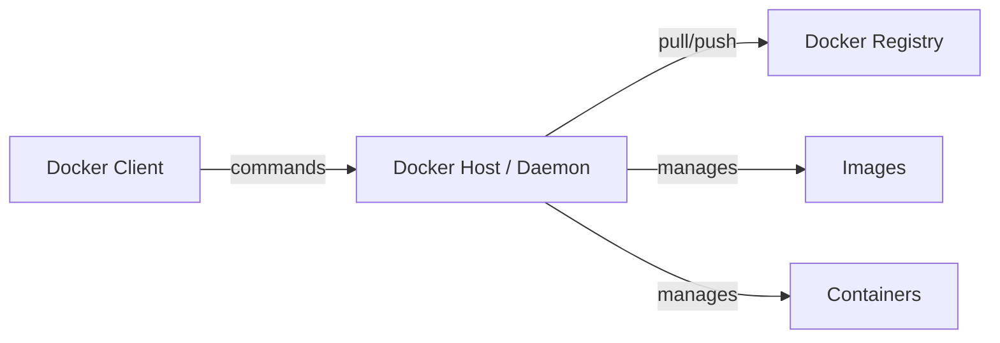

# Docker for Cloud DevOps Engineers

Docker is the industry leader for containerization. It allows you to package an application with all its dependencies into a single "container" that runs anywhere.

## 🐳 Docker Architecture

Docker uses a Client-Server architecture.

- **Docker Client**: The command-line tool (`docker build`, `docker run`) you use to talk to the Docker Host.
- **Docker Host (Daemon)**: The engine that manages containers, images, networks, and volumes.
- **Docker Registry**: Where images are stored (e.g., Docker Hub, AWS ECR).

## 📦 Key Concepts

- **Image**: A read-only template with instructions for creating a Docker container.
- **Container**: A running instance of an image.
- **Dockerfile**: A text file containing all the commands to build an image.
- **Volume**: A way to persist data outside the container.
- **Network**: How containers talk to each other and the outside world.

## 🛠 Docker vs Virtual Machines (VMs)

| Feature | Docker (Containers) | Virtual Machines (VMs) |
|---------|---------------------|------------------------|
| **OS** | Shares the Host OS kernel | Each has its own Guest OS |
| **Size** | Small (MBs) | Large (GBs) |
| **Speed** | Starts in seconds | Starts in minutes |
| **Isolation** | Process-level isolation | Hardware-level isolation |

## 💡 Scenario Based Questions

**Q1: How do you reduce the size of a Docker image?**
- **Ans**: Use multi-stage builds, choose lighter base images (like `alpine`), and combine multiple `RUN` commands into one to reduce layers.

**Q2: What is the difference between `CMD` and `ENTRYPOINT`?**
- **Ans**: `ENTRYPOINT` sets the command that will always run when the container starts. `CMD` provides default arguments that can be easily overwritten by the user.

**Q3: How do you mount a host directory into a container?**
- **Ans**: Using the `-v` or `--mount` flag. Example: `docker run -v /host/path:/container/path image_name`.

**Q4: My container keeps exiting immediately. How do I debug?**
- **Ans**: Check logs using `docker logs <container_id>`. Use `docker inspect` to check for errors. Ensure the main process in the container is running in the foreground.

**Q5: How do you scan a Docker image for vulnerabilities?**
- **Ans**: Use tools like **Trivy**. Command: `trivy image <image_name>`.
