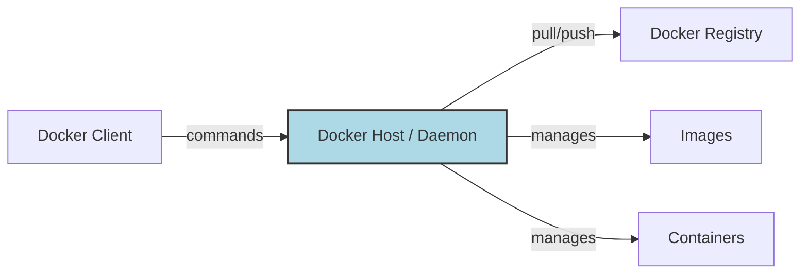

# 🐳 Docker for Cloud DevOps Engineers

> [!NOTE]
> Docker is the industry leader for containerization. It allows you to package an application with all its dependencies into a single "container" that runs consistently across any environment.

## 🏗 Docker Architecture



### Containers vs Virtual Machines (VMs)
| Feature | Docker (Containers) | Virtual Machines (VMs) |
| :--- | :--- | :--- |
| **OS** | Shares Host OS kernel | Has own Guest OS |
| **Size** | MBs (Lightweight) | GBs (Heavy) |
| **Speed** | Instant start | Minutes to boot |

---

## 🛠 Hands-on Proof of Concepts (POCs)

### 1. The Perfect Dockerfile (Node.js)
```dockerfile
# Use a lightweight base image
FROM node:18-alpine

# Set working directory
WORKDIR /app

# Copy deps first to leverage caching
COPY package*.json ./
RUN npm install --production

# Copy source code
COPY . .

# Security: Don't run as root!
USER node

EXPOSE 3000
CMD ["node", "app.js"]
```

### 2. Image Security Scan (Trivy)
> [!IMPORTANT]
> Always scan your images before pushing to a registry!

```bash
#!/bin/bash
# Scan image for HIGH and CRITICAL vulnerabilities
trivy image --severity HIGH,CRITICAL "$1"
```

---

## 💡 Scenario Based Questions

> [!TIP]
> **Q: How to reduce Docker image size?**
> **Ans:** 1. Use **Multi-stage builds**. 2. Use **Alpine** base images. 3. Combine `RUN` commands to reduce layers. 4. Use `.dockerignore`.

> [!WARNING]
> **Q: Difference between `CMD` and `ENTRYPOINT`?**
> **Ans:** `ENTRYPOINT` defines the executable to run, while `CMD` provides default arguments that can be overridden by the user at runtime.

> [!NOTE]
> **Q: My container exited immediately. Why?**
> **Ans:** Containers exit when the primary process stops. Ensure your application runs in the foreground (e.g., don't use `&` or background daemons without a foreground process).

