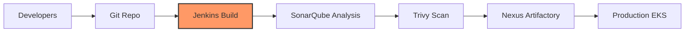

# Jenkins & CI/CD for Cloud DevOps Engineers

Continuous Integration (CI) and Continuous Deployment (CD) are the core of DevOps. Jenkins is the most popular open-source automation server.

## 🔄 CI/CD Flow

- **Code**: Developer pushes code to GitHub/GitLab.
- **Build**: Jenkins triggers a build (Maven, NPM).
- **Test**: Run unit tests and static code analysis (SonarQube).
- **Scan**: Scan the artifact/image for vulnerabilities (Trivy).
- **Store**: Push the artifact to a registry (Nexus, ECR).
- **Deploy**: Deploy the artifact to a server/cluster (K8s, EC2).

## 📜 Types of Pipelines

1. **Freestyle Project**: A legacy way to build pipelines using a graphical UI. Limited and hard to version.
2. **Pipeline (Declarative)**: The modern way using a `Jenkinsfile`. It's "Pipeline as Code." It's readable, versionable, and powerful.

## 🛠 Jenkins Architecture

Jenkins follows a Master-Slave (Controller-Agent) architecture.

- **Controller (Master)**: Handles the UI, configuration, and job scheduling.
- **Agent (Worker)**: Where the actual build tasks are executed. This keeps the Master lightweight and secure.

## 💡 Scenario Based Questions

**Q1: What is a `Jenkinsfile`?**
- **Ans**: A text file that defines the entire CI/CD pipeline as code. It's stored in the root of the source code repository.

**Q2: How do you secure credentials in Jenkins?**
- **Ans**: Use the **Credentials Manager**. You can store passwords, SSH keys, and tokens with unique IDs and use them in the `Jenkinsfile` securely.

**Q3: What is the difference between `Build` and `Deploy` in CI/CD?**
- **Ans**: **Build** is the process of compiling source code into an artifact (like a .jar or Docker image). **Deploy** is the process of moving that artifact into an environment where it can be run.

**Q4: How do you trigger a Jenkins job automatically?**
- **Ans**:
    - **Webhooks**: GitHub/GitLab sends a signal to Jenkins whenever a push occurs. (Recommended)
    - **Poll SCM**: Jenkins periodically checks the Git repo for changes.
    - **Timer**: Scheduled triggers (like a Cron job).

**Q5: What do you do if a Jenkins build fails?**
- **Ans**:
    1. Check the **Console Output** for error messages.
    2. Identify if it's a code issue (test fail), environment issue (disk full/tool missing), or configuration issue.
    3. Fix the root cause and re-run.
