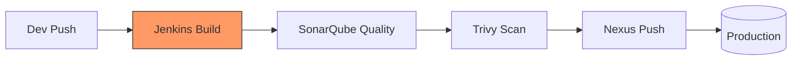

# 🏗 Jenkins & CI/CD for Cloud DevOps Engineers

> [!NOTE]
> Continuous Integration (CI) and Continuous Deployment (CD) are the core of DevOps. Jenkins is the most popular open-source automation server for building "Pipeline as Code".

## 🔄 The CI/CD Pipeline Flow



### Jenkins Master-Agent Architecture
| Role | Responsibility |
| :--- | :--- |
| **Controller (Master)** | Handles the UI, schedules jobs, and manages configuration. |
| **Agent (Node)** | Executes the actual build tasks. Keeps the Master lightweight. |

---

## 🛠 Hands-on Proof of Concept (POC)

### Declarative `Jenkinsfile`
This pipeline covers the entire lifecycle from build to deployment.

```groovy
pipeline {
    agent any
    stages {
        stage('Build') {
            steps { echo 'Compiling source code...' }
        }
        stage('Code Quality') {
            steps { echo 'Running SonarQube analysis...' }
        }
        stage('Security Scan') {
            steps { echo 'Scanning Docker image with Trivy...' }
        }
        stage('Deploy') {
            steps { echo 'Deploying to Kubernetes cluster...' }
        }
    }
}
```

---

## 💡 Scenario Based Questions

> [!TIP]
> **Q: Difference between `Build` and `Deploy`?**
> **Ans:** **Build** is creating an artifact (like a JAR or Docker Image) from source code. **Deploy** is placing that artifact in an environment (Dev, Staging, Prod) where it can be executed.

> [!IMPORTANT]
> **Q: What is a Webhook?**
> **Ans:** A webhook is an automated signal sent by a Git provider (like GitHub) to Jenkins whenever a specific event (like a `git push`) occurs, triggering an immediate build.

> [!WARNING]
> **Q: How to handle secrets in a Jenkinsfile?**
> **Ans:** Use the **Credentials Manager**. Store secrets in the Jenkins UI and inject them into the pipeline using the `withCredentials` block. **Never hardcode passwords in your script!**

