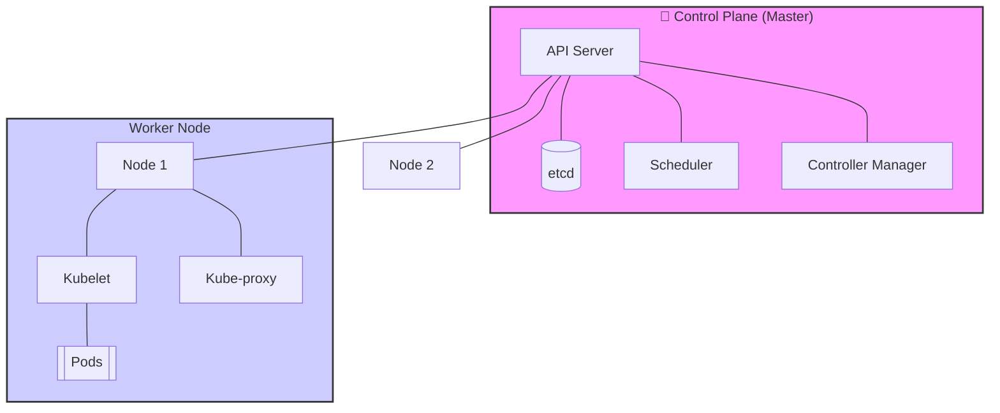
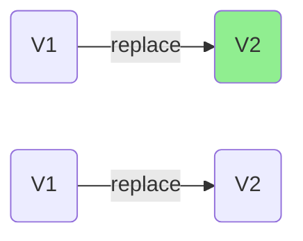
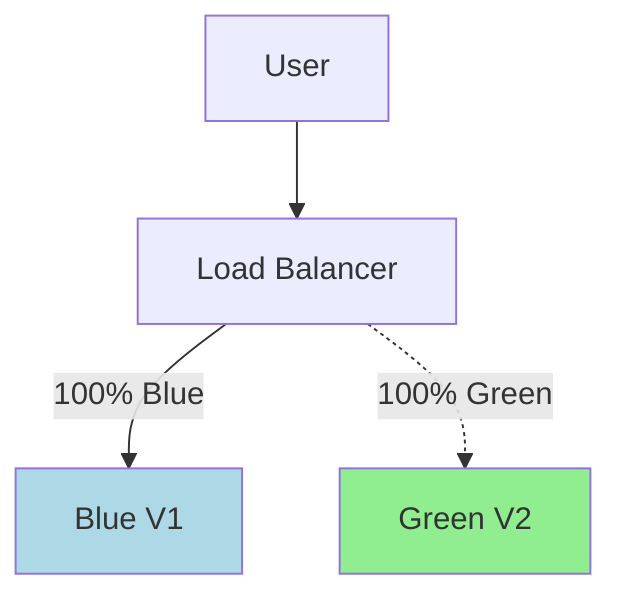
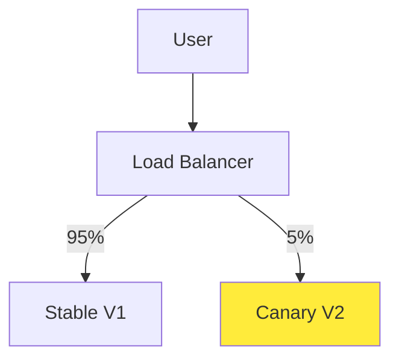
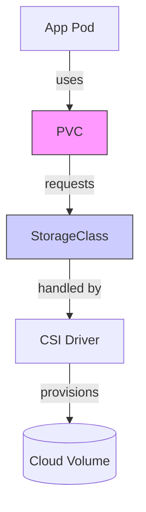

# ☸️ Kubernetes (K8s) for Cloud DevOps Engineers

> [!NOTE]
> Kubernetes is an open-source system for automating deployment, scaling, and management of containerized applications. It is the industry standard for production-grade container orchestration.

## 🎡 Kubernetes Architecture



### Core Components
| Component | Responsibility |
| :--- | :--- |
| **API Server** | The gateway for all commands. |
| **etcd** | The single source of truth; stores cluster state. |
| **Scheduler** | Assigns Pods to Nodes based on resources. |
| **Kubelet** | Ensures containers are running in a Pod. |

---

## 🚀 Deployment Strategies

Choosing the right strategy balances **availability** and **risk**.

> [!TIP]
> Use **RollingUpdate** for most scenarios and **Canary** for testing high-risk features.

### 1. Rolling Update (Default)
Gradually replaces old Pods with new ones.


> [!NOTE]
> **Visualizing Deployment Strategies**
> 

### 2. Blue-Green
Traffic is switched at the Load Balancer level between two identical environments.


### 3. Canary
Releases to a small subset (e.g., 5%) of users first.


---

## ⚡ Kubernetes Resource Management (CPU & Memory)

> [!NOTE]
> **Linux Perspective:** If you're coming from Linux, you already know that processes consume RAM and CPU time is finite. Kubernetes builds on this by explicitly declaring how much resource an application needs.

### The Problem
On a single Linux machine, the kernel decides resource allocation. In Kubernetes, many applications run across multiple nodes, competing for shared resources. Without rules, one workload can starve others.

### Requests vs. Limits
Think of it as a **Reservation vs. a Ceiling**.

| Feature | **Requests (Minimum)** | **Limits (Maximum)** |
| :--- | :--- | :--- |
| **Analogy** | **Reservation**: "I need at least this." | **Ceiling**: "Don't go above this." |
| **Scheduling** | K8s uses this to find a node. | Not used for scheduling. |
| **Enforcement** | Guaranteed available. | Hard cap (can lead to OOMKill). |

> [!IMPORTANT]
> **Visualizing Resource Allocation**
> 

### 🐧 Linux View: Why Requests Matter?
- **CPU Requests**: Similar to guaranteeing CPU availability but not a hard cap. It's a scheduling promise.
- **Memory Requests**: Critical because RAM cannot be overcommitted safely. If a node runs out of memory, the Linux **OOM (Out Of Memory) Killer** will start killing processes.

---

## 💾 Kubernetes Storage (The Full Map)

> [!IMPORTANT]
> Understand the flow to avoid the "PVC stuck in Pending" nightmare.



> [!TIP]
> **Storage Flow Map**
> 

### 🛠 Troubleshooting Storage
- **Pending PVC?** Check if `storageClassName` matches.
- **Data lost after delete?** Ensure `reclaimPolicy: Retain`.
- **Zone mismatch?** Use `volumeBindingMode: WaitForFirstConsumer`.

---

## 🛠 Hands-on Proof of Concepts (POCs)

### 1. Basic Deployment & Service
```yaml
apiVersion: apps/v1
kind: Deployment
metadata:
  name: my-app
spec:
  replicas: 3
  selector:
    matchLabels:
      app: my-app
  template:
    metadata:
      labels:
        app: my-app
    spec:
      containers:
      - name: my-app
        image: nginx:alpine
---
apiVersion: v1
kind: Service
metadata:
  name: my-app-service
spec:
  selector:
    app: my-app
  ports:
    - protocol: TCP
      port: 80
      targetPort: 80
  type: LoadBalancer
```

### 2. Canary Deployment Manifest
```yaml
# Deployment V1 (Stable)
apiVersion: apps/v1
kind: Deployment
metadata:
  name: app-stable
spec:
  replicas: 9
  selector:
    matchLabels:
      app: app
      version: stable
---
# Deployment V2 (Canary)
apiVersion: apps/v1
kind: Deployment
metadata:
  name: app-canary
spec:
  replicas: 1
  selector:
    matchLabels:
      app: app
      version: canary
```

### 3. Storage Configuration
```yaml
apiVersion: storage.k8s.io/v1
kind: StorageClass
metadata:
  name: fast-storage
provisioner: ebs.csi.aws.com
reclaimPolicy: Retain
volumeBindingMode: WaitForFirstConsumer
---
apiVersion: v1
kind: PersistentVolumeClaim
metadata:
  name: my-app-pvc
spec:
  accessModes: ["ReadWriteOnce"]
  resources:
    requests:
      storage: 10Gi
  storageClassName: fast-storage
```

---

## 💡 Scenario Based Questions

> [!WARNING]
> **Q: My Pod is in `ImagePullBackOff`. What do I do?**
> **Ans:** 1. Verify image name/tag. 2. Check if image exists in registry. 3. Ensure `imagePullSecrets` are configured for private repos.

> [!TIP]
> **Q: How to handle high traffic spikes automatically?**
> **Ans:** Use the **Horizontal Pod Autoscaler (HPA)**. It scales Pods based on CPU/RAM usage.

> [!NOTE]
> **Q: Deployment vs StatefulSet?**
> **Ans:** Use **Deployment** for stateless apps (Web servers). Use **StatefulSet** for stateful apps (Databases) requiring stable IDs and storage.

---

## 📚 Resources & Deep Dives
- [📄 **Kubernetes CPU and Memory Deep Dive (PDF)**](./PN%201.pdf)

