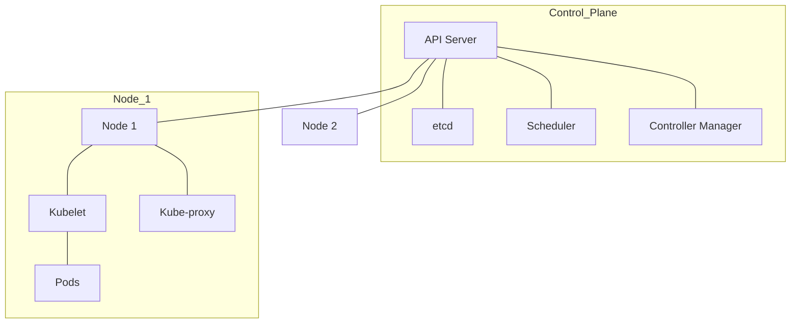

# Kubernetes (K8s) for Cloud DevOps Engineers

Kubernetes is an open-source system for automating deployment, scaling, and management of containerized applications.

## 🎡 Kubernetes Architecture

Kubernetes follows a Master-Worker (Control Plane-Node) architecture.

- **Control Plane (Master)**: The "brain" of the cluster.
    - **API Server**: The gateway for all commands.
    - **etcd**: Key-value store for cluster data.
    - **Scheduler**: Decides which node a Pod should run on.
    - **Controller Manager**: Maintains the desired state (e.g., ensuring 3 replicas are running).
- **Worker Nodes**: Where the applications run.
    - **Kubelet**: An agent that runs on each node and ensures containers are running in a Pod.
    - **Kube-proxy**: Handles networking for the Pods.
    - **Container Runtime**: (Docker, containerd) runs the containers.

## 📦 Core Objects

- **Pod**: The smallest deployable unit (contains one or more containers).
- **Deployment**: Manages Pods (scaling, rolling updates).
- **Service**: Provides a stable IP address and DNS name for a set of Pods.
- **ConfigMap/Secret**: Used for configuration and sensitive data.
- **Namespace**: A virtual cluster within a cluster (for isolation).

## 💡 Scenario Based Questions

**Q1: What is the difference between a Deployment and a StatefulSet?**
- **Ans**: **Deployment** is for stateless apps (where any pod is interchangeable). **StatefulSet** is for stateful apps (like databases) where each pod needs a unique, persistent identity and stable storage.

**Q2: A Pod is in `ImagePullBackOff` status. What are the possible causes?**
- **Ans**:
    1. Image name or tag is incorrect.
    2. Image does not exist in the registry.
    3. Kubernetes does not have permission to pull the image (e.g., missing `imagePullSecrets`).

**Q3: How do you perform a rolling update in K8s?**
- **Ans**: Simply update the image version in the Deployment manifest and run `kubectl apply -f manifest.yaml`. K8s will gradually replace old pods with new ones.

**Q4: What is a Horizontal Pod Autoscaler (HPA)?**
- **Ans**: It automatically scales the number of Pods based on CPU or memory usage.

**Q5: What is an Ingress?**
- **Ans**: An Ingress is an API object that manages external access to the services in a cluster, typically HTTP. It can provide load balancing, SSL termination, and name-based virtual hosting.
