# ☸️ Kubernetes (K8s) for Cloud DevOps Engineers

> [!NOTE]
> Kubernetes is an open-source system for automating deployment, scaling, and management of containerized applications. It is the industry standard for production-grade container orchestration.

## 🎡 Kubernetes Architecture

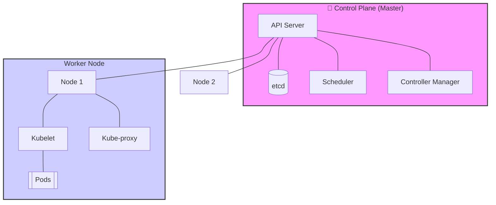

### Core Components
| Component | Responsibility |
| :--- | :--- |
| **API Server** | The gateway for all commands. |
| **etcd** | The single source of truth; stores cluster state. |
| **Scheduler** | Assigns Pods to Nodes based on resources. |
| **Kubelet** | Ensures containers are running in a Pod. |

---

## 🚀 Deployment Strategies

Choosing the right strategy balances **availability** and **risk**.

> [!TIP]
> Use **RollingUpdate** for most scenarios and **Canary** for testing high-risk features.

### 1. Rolling Update (Default)
Gradually replaces old Pods with new ones.
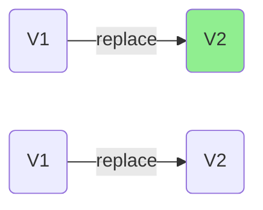

> [!NOTE]
> **Visualizing Deployment Strategies**
> 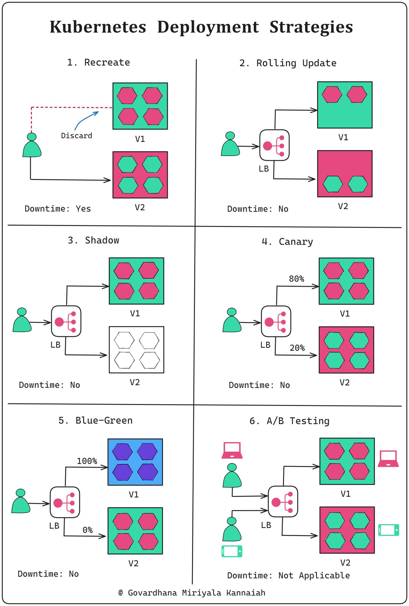

### 2. Blue-Green
Traffic is switched at the Load Balancer level between two identical environments.
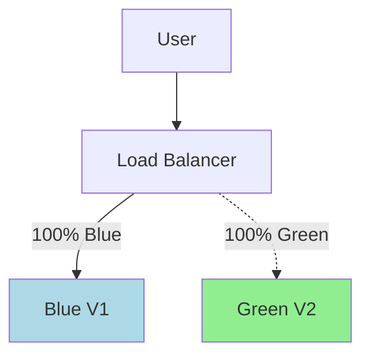

### 3. Canary
Releases to a small subset (e.g., 5%) of users first.
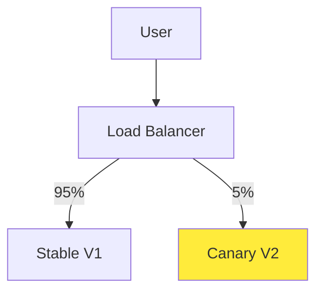

---

## ⚡ Kubernetes Resource Management (CPU & Memory)

> [!NOTE]
> **Linux Perspective:** If you're coming from Linux, you already know that processes consume RAM and CPU time is finite. Kubernetes builds on this by explicitly declaring how much resource an application needs.

### The Problem
On a single Linux machine, the kernel decides resource allocation. In Kubernetes, many applications run across multiple nodes, competing for shared resources. Without rules, one workload can starve others.

### Requests vs. Limits
Think of it as a **Reservation vs. a Ceiling**.

| Feature | **Requests (Minimum)** | **Limits (Maximum)** |
| :--- | :--- | :--- |
| **Analogy** | **Reservation**: "I need at least this." | **Ceiling**: "Don't go above this." |
| **Scheduling** | K8s uses this to find a node. | Not used for scheduling. |
| **Enforcement** | Guaranteed available. | Hard cap (can lead to OOMKill). |

> [!IMPORTANT]
> **Visualizing Resource Allocation**
> 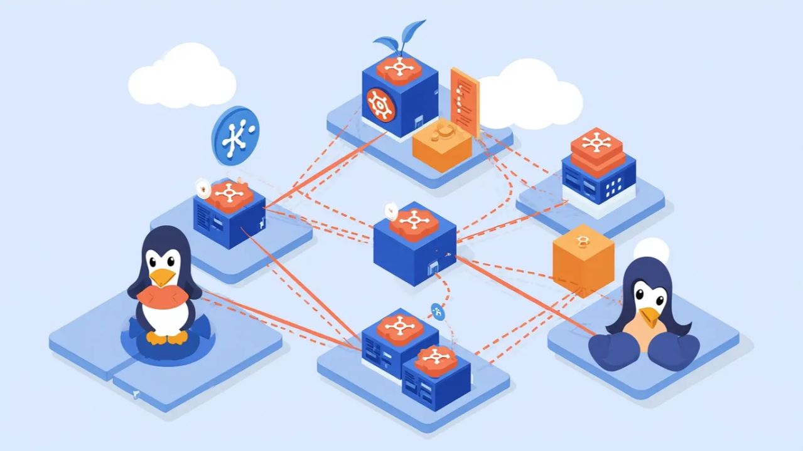

### 🐧 Linux View: Why Requests Matter?
- **CPU Requests**: Similar to guaranteeing CPU availability but not a hard cap. It's a scheduling promise.
- **Memory Requests**: Critical because RAM cannot be overcommitted safely. If a node runs out of memory, the Linux **OOM (Out Of Memory) Killer** will start killing processes.

---

## 💾 Kubernetes Storage (The Full Map)

> [!IMPORTANT]
> Understand the flow to avoid the "PVC stuck in Pending" nightmare.

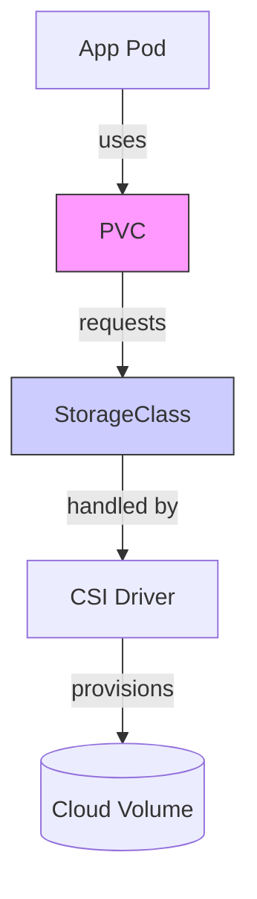

> [!TIP]
> **Storage Flow Map**
> 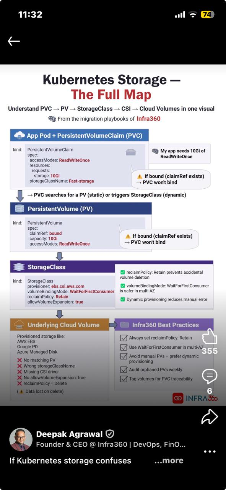

### 🛠 Troubleshooting Storage
- **Pending PVC?** Check if `storageClassName` matches.
- **Data lost after delete?** Ensure `reclaimPolicy: Retain`.
- **Zone mismatch?** Use `volumeBindingMode: WaitForFirstConsumer`.

---

## 🛠 Hands-on Proof of Concepts (POCs)

### 1. Basic Deployment & Service
```yaml
apiVersion: apps/v1
kind: Deployment
metadata:
  name: my-app
spec:
  replicas: 3
  selector:
    matchLabels:
      app: my-app
  template:
    metadata:
      labels:
        app: my-app
    spec:
      containers:
      - name: my-app
        image: nginx:alpine
---
apiVersion: v1
kind: Service
metadata:
  name: my-app-service
spec:
  selector:
    app: my-app
  ports:
    - protocol: TCP
      port: 80
      targetPort: 80
  type: LoadBalancer
```

### 2. Canary Deployment Manifest
```yaml
# Deployment V1 (Stable)
apiVersion: apps/v1
kind: Deployment
metadata:
  name: app-stable
spec:
  replicas: 9
  selector:
    matchLabels:
      app: app
      version: stable
---
# Deployment V2 (Canary)
apiVersion: apps/v1
kind: Deployment
metadata:
  name: app-canary
spec:
  replicas: 1
  selector:
    matchLabels:
      app: app
      version: canary
```

### 3. Storage Configuration
```yaml
apiVersion: storage.k8s.io/v1
kind: StorageClass
metadata:
  name: fast-storage
provisioner: ebs.csi.aws.com
reclaimPolicy: Retain
volumeBindingMode: WaitForFirstConsumer
---
apiVersion: v1
kind: PersistentVolumeClaim
metadata:
  name: my-app-pvc
spec:
  accessModes: ["ReadWriteOnce"]
  resources:
    requests:
      storage: 10Gi
  storageClassName: fast-storage
```

---

## 🧠 Comprehensive Interview Q&A

> [!TIP]
> This section contains 100+ production-grade interview questions. Use them to test your knowledge or prepare for your next DevOps role.

### I. Kubernetes Fundamentals and Architecture

<details>
<summary>1. What is Kubernetes and why is it used?</summary>
<blockquote>
<b>Answer:</b> Kubernetes (K8s) is an open-source container orchestration platform that automates the deployment, scaling, and management of containerized applications. It solves the challenges of managing large, distributed applications across multiple servers by providing features like automated scheduling, self-healing, rolling updates, and service discovery.
</blockquote>
</details>

<details>
<summary>2. Explain the core components of Kubernetes architecture.</summary>
<blockquote>
<b>Answer:</b> Kubernetes architecture consists of:
<ul>
  <li><b>Control Plane (Master):</b> API Server (Gateway), etcd (Storage), Scheduler (Decision maker), Controller Manager (Regulator).</li>
  <li><b>Worker Nodes:</b> Kubelet (Agent), Kube-proxy (Networking), Container Runtime (Execution).</li>
</ul>

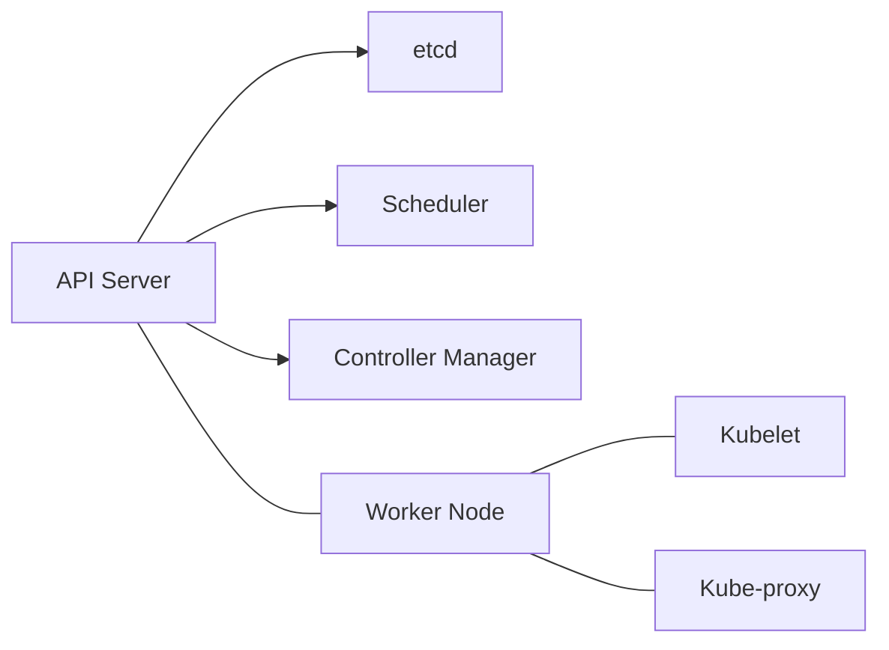
</blockquote>
</details>

<details>
<summary>3. What is a Pod in Kubernetes? Why is it the smallest deployable unit?</summary>
<blockquote>
<b>Answer:</b> A Pod represents a single instance of a running process. Containers inside a Pod share the same network namespace (IP) and storage, making them "tightly coupled".
</blockquote>
</details>

<details>
<summary>4. What is the relationship between Kubernetes and Docker?</summary>
<blockquote>
<b>Answer:</b> **Docker builds the house (container), Kubernetes manages the neighborhood (cluster).** K8s manages OCI-compliant runtimes, including Docker.
</blockquote>
</details>

<details>
<summary>5. Explain Namespaces in Kubernetes.</summary>
<blockquote>
<b>Answer:</b> Virtual clusters within a physical cluster. Used for isolation, RBAC, and resource quotas.
</blockquote>
</details>

<details>
<summary>6. What are Labels and Selectors?</summary>
<blockquote>
<b>Answer:</b> **Labels** are key-value pairs (tags). **Selectors** are used to filter objects based on those tags.
</blockquote>
</details>

<details>
<summary>7. What is a Service in Kubernetes?</summary>
<blockquote>
<b>Answer:</b> A stable network endpoint (Fixed IP/DNS) for a group of ephemeral Pods.
</blockquote>
</details>

<details>
<summary>8. ClusterIP vs. NodePort vs. LoadBalancer.</summary>
<blockquote>
<b>Answer:</b>
<ul>
  <li>**ClusterIP**: Internal only IP.</li>
  <li>**NodePort**: Static port on every node (external access via NodeIP:Port).</li>
  <li>**LoadBalancer**: Automatic cloud LB provisioning.</li>
</ul>

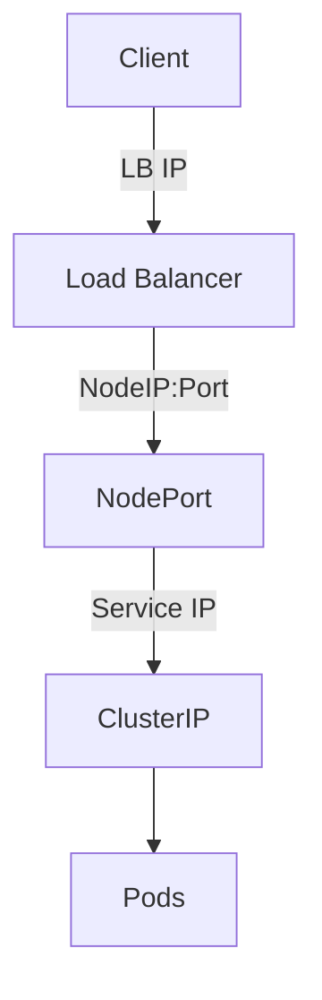
</blockquote>
</details>

<details>
<summary>9. What is a Deployment?</summary>
<blockquote>
<b>Answer:</b> A higher-level object that manages Pods and ReplicaSets, providing declarative updates and self-healing.
</blockquote>
</details>

<details>
<summary>10. ReplicaSet vs. Deployment.</summary>
<blockquote>
<b>Answer:</b> ReplicaSet ensures replica counts. Deployment manages the rollout/vserioning of ReplicaSets.
</blockquote>
</details>

<details>
<summary>11. What is a StatefulSet?</summary>
<blockquote>
<b>Answer:</b> Used for stateful apps (Databases). Provides stable hostnames (pod-0, pod-1) and stable storage.
</blockquote>
</details>

<details>
<summary>12. What is a DaemonSet?</summary>
<blockquote>
<b>Answer:</b> Ensures a Pod runs on **every** node. Used for logging (Fluentd) or monitoring (Prometheus Node Exporter).
</blockquote>
</details>

<details>
<summary>13. ConfigMaps vs. Secrets.</summary>
<blockquote>
<b>Answer:</b> **ConfigMaps** = non-sensitive config. **Secrets** = sensitive data (base64 encoded).
</blockquote>
</details>

<details>
<summary>14. Ingress vs. LoadBalancer Service.</summary>
<blockquote>
<b>Answer:</b> Ingress is Layer 7 (HTTP routing, paths). LoadBalancer is Layer 4 (TCP/UDP).
</blockquote>
</details>

<details>
<summary>15. How does Kubernetes handle storage orchestration?</summary>
<blockquote>
<b>Answer:</b> Using PV (Resource), PVC (Request), and StorageClass (Provisioner).
</blockquote>
</details>

---

### II. Networking in Kubernetes

<details>
<summary>16. Explain the Kubernetes networking model.</summary>
<blockquote>
<b>Answer:</b> A "flat" model where all Pods can talk to all other Pods without NAT, regardless of which node they are on.
</blockquote>
</details>

<details>
<summary>17. Pod-to-Pod communication (Same Node).</summary>
<blockquote>
<b>Answer:</b> Communication occurs via a virtual bridge (CNI bridge) on the node.
</blockquote>
</details>

<details>
<summary>18. Pod-to-Pod communication (Across Nodes).</summary>
<blockquote>
<b>Answer:</b> Uses an **overlay network** (e.g., VXLAN) created by the CNI plugin.
</blockquote>
</details>

<details>
<summary>19. What are Network Policies?</summary>
<blockquote>
<b>Answer:</b> Firewall rules for Pods. They restrict traffic between Pods based on labels or namespaces.
</blockquote>
</details>

<details>
<summary>20. How does K8s handle DNS?</summary>
<blockquote>
<b>Answer:</b> Uses **CoreDNS**. Services get records like `service.namespace.svc.cluster.local`.
</blockquote>
</details>

---

### III. Deployment and Scaling

<details>
<summary>21. Describe the process of a rolling update.</summary>
<blockquote>
<b>Answer:</b> K8s creates new Pods, waits for them to be healthy (Ready), and then terminates old Pods one by one. This ensures zero downtime.
</blockquote>
</details>

<details>
<summary>22. How do you perform a rollback?</summary>
<blockquote>
<b>Answer:</b> <code>kubectl rollout undo deployment &lt;name&gt;</code>. You can also rollback to a specific revision using <code>--to-revision=X</code>.
</blockquote>
</details>

<details>
<summary>23. What is Horizontal Pod Autoscaling (HPA)?</summary>
<blockquote>
<b>Answer:</b> Scales the number of Pod replicas based on metrics like CPU or memory.

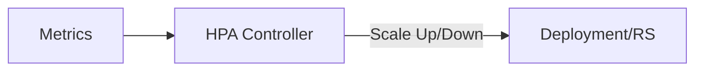
</blockquote>
</details>

<details>
<summary>24. What is Vertical Pod Autoscaling (VPA)?</summary>
<blockquote>
<b>Answer:</b> Adjusts the resource **requests and limits** of existing Pods based on historical usage.
</blockquote>
</details>

<details>
<summary>25. What is Cluster Autoscaler?</summary>
<blockquote>
<b>Answer:</b> Automatically adds or removes **Nodes** from the cluster if Pods cannot be scheduled due to lack of resources.
</blockquote>
</details>

<details>
<summary>26. How to troubleshoot a failed Deployment?</summary>
<blockquote>
<b>Answer:</b> 
1. `kubectl describe deployment`
2. `kubectl get pods`
3. `kubectl logs <pod>`
4. `kubectl describe pod`
</blockquote>
</details>

<details>
<summary>27. Liveness vs. Readiness Probes.</summary>
<blockquote>
<b>Answer:</b>
<ul>
  <li>**Liveness**: "Am I alive?" (Restart if fail).</li>
  <li>**Readiness**: "Am I ready for traffic?" (Remove from Service if fail).</li>
</ul>
</blockquote>
</details>

<details>
<summary>28. What is a CronJob?</summary>
<blockquote>
<b>Answer:</b> Runs Jobs on a schedule (e.g., daily backups).
</blockquote>
</details>

---

### IV. Security and Access Control

<details>
<summary>29. Explain Role-Based Access Control (RBAC).</summary>
<blockquote>
<b>Answer:</b> Defines **Who** (Subject) can do **What** (Verbs) to **Which** resource.
<ul>
  <li>**Role**: Namespace level.</li>
  <li>**ClusterRole**: Cluster-wide.</li>
</ul>
</blockquote>
</details>

<details>
<summary>30. What are Service Accounts?</summary>
<blockquote>
<b>Answer:</b> Identity for processes running inside a Pod to talk to the API Server.
</blockquote>
</details>

<details>
<summary>31. How to secure the API Server?</summary>
<blockquote>
<b>Answer:</b> Use TLS, RBAC, Admission Controllers, and Network Policies.
</blockquote>
</details>

<details>
<summary>32. What are Pod Security Standards (PSS)?</summary>
<blockquote>
<b>Answer:</b> Policies (Privileged, Baseline, Restricted) that prevent dangerous Pod configurations.
</blockquote>
</details>

---

### V. Monitoring and Logging

<details>
<summary>33. How to monitor a K8s cluster?</summary>
<blockquote>
<b>Answer:</b> Use **Prometheus** for metrics and **Grafana** for visualization.
</blockquote>
</details>

<details>
<summary>34. How to collect logs?</summary>
<blockquote>
<b>Answer:</b> Standard logging uses the **ELK Stack** (Elasticsearch, Logstash, Kibana) or **EFK** (Fluentd).
</blockquote>
</details>

<details>
<summary>35. Role of Prometheus?</summary>
<blockquote>
<b>Answer:</b> Scrapes time-series metrics from targets via HTTP.
</blockquote>
</details>

---

### VI. Advanced Topics and Troubleshooting

<details>
<summary>36. What is a CRD and Operator?</summary>
<blockquote>
<b>Answer:</b> 
<ul>
  <li>**CRD**: Custom Resource Definition (New object type).</li>
  <li>**Operator**: A controller that manages complex stateful apps (e.g., a DB Operator).</li>
</ul>
</blockquote>
</details>

<details>
<summary>37. Taints and Tolerations.</summary>
<blockquote>
<b>Answer:</b> **Taints** repel Pods from nodes. **Tolerations** allow Pods to stay on tainted nodes.

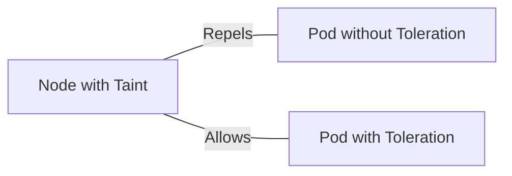
</blockquote>
</details>

<details>
<summary>38. Node Affinity vs. Anti-Affinity.</summary>
<blockquote>
<b>Answer:</b> **Affinity** attracts Pods to nodes. **Anti-Affinity** keeps them away.
</blockquote>
</details>

<details>
<summary>39. Pod stuck in Pending?</summary>
<blockquote>
<b>Answer:</b> Check resource limits, taints, or volume binding issues.
</blockquote>
</details>

<details>
<summary>40. Troubleshoot unreachable Service?</summary>
<blockquote>
<b>Answer:</b> Verify Service type, selector/endpoints, and Readiness probes.
</blockquote>
</details>

<details>
<summary>41. What is a Helm chart?</summary>
<blockquote>
<b>Answer:</b> Package manager for K8s. It templates YAML manifests for reusability.
</blockquote>
</details>

<details>
<summary>42. How does self-healing work?</summary>
<blockquote>
<b>Answer:</b> Through Controllers (ReplicaSet) ensuring desired state and Kubelet restarting failed containers.
</blockquote>
</details>

<details>
<summary>43. What is a Pod Disruption Budget (PDB)?</summary>
<blockquote>
<b>Answer:</b> Ensures a minimum number of Pods remain available during planned maintenance.
</blockquote>
</details>

<details>
<summary>44. How does `kubectl exec` work?</summary>
<blockquote>
<b>Answer:</b> Establishes a stream between the local CLI and the container via the API Server and Kubelet.
</blockquote>
</details>

<details>
<summary>45. What is GitOps?</summary>
<blockquote>
<b>Answer:</b> Managing infrastructure and apps where **Git is the single source of truth**. Tools: ArgoCD, Flux.
</blockquote>
</details>

---

### VII. Real-World Scenarios

<details>
<summary>46. Pods constantly restarting?</summary>
<blockquote>
<b>Answer:</b> Check `CrashLoopBackOff`. Usually OOMKill or app configuration error.
</blockquote>
</details>

<details>
<summary>47. Zero-downtime deployment?</summary>
<blockquote>
<b>Answer:</b> `RollingUpdate` strategy + Readiness probes.
</blockquote>
</details>

<details>
<summary>48. ImagePullBackOff?</summary>
<blockquote>
<b>Answer:</b> Wrong tag, private registry (secret missing), or network issue.
</blockquote>
</details>

<details>
<summary>49. Scaling down a StatefulSet?</summary>
<blockquote>
<b>Answer:</b> K8s terminates pods in reverse order (e.g., db-2 then db-1). Note: PVCs are NOT deleted automatically.
</blockquote>
</details>

<details>
<summary>50. Ensure 3 pods always run during maintenance?</summary>
<blockquote>
<b>Answer:</b> Create a `PodDisruptionBudget` with `minAvailable: 3`.
</blockquote>
</details>

<details>
<summary>51. High CPU on one node?</summary>
<blockquote>
<b>Answer:</b> 1. `kubectl top nodes` 2. `kubectl top pods --all-namespaces` 3. Check for specific pod resource leaks or mis-scheduling.
</blockquote>
</details>

<details>
<summary>52. Access DB in different namespace?</summary>
<blockquote>
<b>Answer:</b> Use the FQDN: `service.namespace.svc.cluster.local`.
</blockquote>
</details>

---

### VIII. Ecosystem and CNCF Projects

<details>
<summary>53. What is the CNCF?</summary>
<blockquote>
<b>Answer:</b> Cloud Native Computing Foundation (hosts K8s, Prometheus, Helm, etc.). Its goal is to make cloud-native computing ubiquitous.
</blockquote>
</details>

<details>
<summary>54. Purpose of Prometheus, Helm, Istio, Envoy?</summary>
<blockquote>
<b>Answer:</b> 
<ul>
  <li>**Prometheus**: Monitoring/Alerting.</li>
  <li>**Helm**: Package Manager.</li>
  <li>**Istio**: Service Mesh (Security, Traffic).</li>
  <li>**Envoy**: Data-plane proxy for Service Mesh.</li>
</ul>
</blockquote>
</details>

<details>
<summary>55. Have you worked with K8s CI/CD?</summary>
<blockquote>
<b>Answer:</b> (Example) Yes, using Jenkins and Helm. Pipeline builds image -> Pushes to Registry -> Helm upgrade on Cluster.
</blockquote>
</details>

<details>
<summary>56. Challenges of K8s in production?</summary>
<blockquote>
<b>Answer:</b> Complexity, Networking issues (CNI), Persistent storage management, and Security (RBAC).
</blockquote>
</details>

---

### IX. Deeper Dive into K8s Concepts

<details>
<summary>57. Explain the Pod lifecycle.</summary>
<blockquote>
<b>Answer:</b> `Pending` -> `Running` -> `Succeeded` / `Failed`.
</blockquote>
</details>

<details>
<summary>58. What are Init Containers?</summary>
<blockquote>
<b>Answer:</b> Containers that run and **finish** before the main app container starts. Used for setup (DB migrations, cloning repos).
</blockquote>
</details>

<details>
<summary>59. Resource Requests vs. Limits.</summary>
<blockquote>
<b>Answer:</b> **Requests** = Guaranteed minimum (used for scheduling). **Limits** = Maximum allowed (causes OOMKill or Throttling).
</blockquote>
</details>

<details>
<summary>60. ReadWriteMany Access Mode?</summary>
<blockquote>
<b>Answer:</b> Allows multiple nodes to read/write to the same volume simultaneously (e.g., NFS, AWS EFS).
</blockquote>
</details>

<details>
<summary>61. Application-level Load Balancing without Cloud LB?</summary>
<blockquote>
<b>Answer:</b> Use an **Ingress Controller** or a **Service Mesh** (Istio).
</blockquote>
</details>

<details>
<summary>62. emptyDir vs. hostPath.</summary>
<blockquote>
<b>Answer:</b> 
<ul>
  <li>`emptyDir`: Temporary, dies with Pod.</li>
  <li>`hostPath`: Mounts node filesystem into Pod.</li>
</ul>
</blockquote>
</details>

<details>
<summary>63. Service not routing traffic?</summary>
<blockquote>
<b>Answer:</b> Check `Endpoints` (`kubectl describe svc`). If empty, selector labels don't match Pod labels.
</blockquote>
</details>

<details>
<summary>64. What is a Headless Service?</summary>
<blockquote>
<b>Answer:</b> A service without a ClusterIP. DNS query returns actual Pod IPs instead of a single Service IP. Used for Stateful apps.
</blockquote>
</details>

<details>
<summary>65. nodeSelector vs. Tolerations.</summary>
<blockquote>
<b>Answer:</b> **nodeSelector** forces Pod to a node. **Tolerations** allow Pod onto a tainted node.
</blockquote>
</details>

---

### X. Scenario-Based Questions (Advanced)

<details>
<summary>66. Legacy app requires host kernel module?</summary>
<blockquote>
<b>Answer:</b> Use `nodeSelector` to target specific nodes where the module is pre-loaded or use a DaemonSet to load the module.
</blockquote>
</details>

<details>
<summary>67. Migrating Monolith to Microservices?</summary>
<blockquote>
<b>Answer:</b> Focus on Containerization, API design, Service Discovery, Config management, and Observability.
</blockquote>
</details>

<details>
<summary>68. Restrict DB access to specific app only?</summary>
<blockquote>
<b>Answer:</b> Use a **NetworkPolicy** allowing ingress only from the app's labels.
</blockquote>
</details>

<details>
<summary>69. Environment specific config (Dev/Prod)?</summary>
<blockquote>
<b>Answer:</b> Use **Helm Values** or **Kustomize Overlays** to patch environment-specific values.
</blockquote>
</details>

<details>
<summary>70. Pod cannot write to volume?</summary>
<blockquote>
<b>Answer:</b> Check PVC status, StorageClass provisioner, and `securityContext` (UID/GID permissions).
</blockquote>
</details>

---

### XI. Advanced Kubernetes Concepts

<details>
<summary>71. What is an Admission Controller?</summary>
<blockquote>
<b>Answer:</b> A plugin that intercepts API requests (e.g., `LimitRanger` or `ResourceQuota`) before they reach etcd.
</blockquote>
</details>

<details>
<summary>72. Handle certificates and TLS?</summary>
<blockquote>
<b>Answer:</b> Use **cert-manager** to automate issuance/renewal via Let's Encrypt.
</blockquote>
</details>

<details>
<summary>73. Explain Operators in detail.</summary>
<blockquote>
<b>Answer:</b> A Custom Controller using CRDs to manage complex, stateful applications (e.g., handling DB backups automatically).
</blockquote>
</details>

<details>
<summary>74. What is kubeconfig?</summary>
<blockquote>
<b>Answer:</b> Configuration file (~/.kube/config) containing cluster credentials and context.
</blockquote>
</details>

<details>
<summary>75. How does K8s handle garbage collection?</summary>
<blockquote>
<b>Answer:</b> Automatically removes completed Jobs, orphaned objects, and unused container images.
</blockquote>
</details>

<details>
<summary>76. Multi-Cluster K8s? Why?</summary>
<blockquote>
<b>Answer:</b> High Availability (multiple regions), Regulatory compliance (Data residency), and Isolation.
</blockquote>
</details>

<details>
<summary>77. What is etcd? Key traits?</summary>
<blockquote>
<b>Answer:</b> Distributed key-value store. Traits: **Consistent** (Raft algorithm), **Highly Available**, and stores total cluster state.
</blockquote>
</details>

<details>
<summary>78. How does the K8s Scheduler work?</summary>
<blockquote>
<b>Answer:</b> Filters nodes (based on requests/taints) and ranks them (based on affinity/priority) to select the best fit.
</blockquote>
</details>

---

### XII. Miscellaneous and Best Practices

<details>
<summary>79. What is a Pod Preset?</summary>
<blockquote>
<b>Answer:</b> (Deprecated in favor of Admission Webhooks) Used to inject information (secrets, volumes) into Pods at creation time without modifying the template.
</blockquote>
</details>

<details>
<summary>80. Resource Quotas vs. Limit Ranges.</summary>
<blockquote>
<b>Answer:</b> 
<ul>
  <li>**ResourceQuotas**: Limits aggregate resource consumption per Namespace.</li>
  <li>**LimitRanges**: Constraints on min/max resources per Pod/Container in a Namespace.</li>
</ul>
</blockquote>
</details>

<details>
<summary>81. Kubernetes API Versioning (v1, v1beta1, v1alpha1)?</summary>
<blockquote>
<b>Answer:</b> 
<ul>
  <li>**Alpha**: Disabled by default, can be buggy.</li>
  <li>**Beta**: Enabled by default, code is tested.</li>
  <li>**Stable (v1)**: Safe for production.</li>
</ul>
</blockquote>
</details>

<details>
<summary>82. How do you handle database migrations in K8s?</summary>
<blockquote>
<b>Answer:</b> Usually via **Init Containers** or a **k8s Job** that runs before the deployment is updated.
</blockquote>
</details>

<details>
<summary>83. What is Kustomize?</summary>
<blockquote>
<b>Answer:</b> A template-free way to customize K8s manifests (built into `kubectl`).
</blockquote>
</details>

<details>
<summary>84. How to perform a Blue-Green deployment manually?</summary>
<blockquote>
<b>Answer:</b> 1. Deploy V2 (Green). 2. Test Green. 3. Update the Service selector to point to Green labels.
</blockquote>
</details>

<details>
<summary>85. What is a Vertical Pod Autoscaler (VPA) recommendation?</summary>
<blockquote>
<b>Answer:</b> VPA analyzes historical usage and recommends the optimal CPU/RAM requests for your containers.
</blockquote>
</details>

<details>
<summary>86. Role of `kube-proxy`?</summary>
<blockquote>
<b>Answer:</b> Maintains network rules on nodes. These rules allow network communication to your Pods from inside/outside the cluster.
</blockquote>
</details>

<details>
<summary>87. What is the ‘pause’ container in a Pod?</summary>
<blockquote>
<b>Answer:</b> A container that holds the network namespace for the Pod. All other containers in the Pod join this namespace.
</blockquote>
</details>

<details>
<summary>88. How to debug a 502 Bad Gateway from an Ingress?</summary>
<blockquote>
<b>Answer:</b> 
1. Check Ingress Controller logs.
2. Verify Backend Service exists.
3. Check Pod health (Readiness probes).
</blockquote>
</details>

<details>
<summary>89. What is a Sidecar pattern?</summary>
<blockquote>
<b>Answer:</b> Running a secondary container alongside the main app to provide helper functions (e.g., Log proxy, Auth proxy).
</blockquote>
</details>

<details>
<summary>90. Multi-container Pods: When to use?</summary>
<blockquote>
<b>Answer:</b> Only when containers must share lifecycle, network, and storage (e.g., App + Logging agent).
</blockquote>
</details>

<details>
<summary>91. What is an Anti-Affinity rule?</summary>
<blockquote>
<b>Answer:</b> Ensures that Pods of the same type are NOT scheduled on the same node (for High Availability).
</blockquote>
</details>

<details>
<summary>92. How to update a Secret without restarting Pods?</summary>
<blockquote>
<b>Answer:</b> If mounted as a volume, K8s updates the file. The app must be designed to watch for file changes (hot-reload).
</blockquote>
</details>

<details>
<summary>93. K8s on Bare Metal vs. Cloud?</summary>
<blockquote>
<b>Answer:</b> Cloud is easier (managed LB/Storage). Bare Metal requires setting up Load Balancers (MetalLB) and Storage (Ceph/NFS).
</blockquote>
</details>

<details>
<summary>94. What is `kubectl rollout history`?</summary>
<blockquote>
<b>Answer:</b> Shows the revisions of a deployment, allowing you to see what changed and rollback if needed.
</blockquote>
</details>

<details>
<summary>95. How to drain a node for maintenance?</summary>
<blockquote>
<b>Answer:</b> `kubectl drain <node> --ignore-daemonsets --delete-emptydir-data`. It evicts pods safely.
</blockquote>
</details>

<details>
<summary>96. Node shell access safely?</summary>
<blockquote>
<b>Answer:</b> Use `kubectl node-shell` (via plugin) or a temporary privileged Pod (not recommended for prod).
</blockquote>
</details>

<details>
<summary>97. Difference between `apply` and `replace`?</summary>
<blockquote>
<b>Answer:</b> `apply` is declarative (merges changes). `replace` is imperative (overwrites the whole object).
</blockquote>
</details>

<details>
<summary>98. How does K8s ensure container health?</summary>
<blockquote>
<b>Answer:</b> Through Liveness/Readiness/Startup probes and the Restart Policy of the Pod.
</blockquote>
</details>

<details>
<summary>99. What is the ‘control plane’ of a Service Mesh?</summary>
<blockquote>
<b>Answer:</b> (e.g., Istiod) It manages and configures the proxies (Envoy) that route traffic.
</blockquote>
</details>

<details>
<summary>100. Why is Kubernetes considered "Hard"?</summary>
<blockquote>
<b>Answer:</b> Because it’s a generic platform that requires choosing many external components (CNI, Storage, Ingress, Monitoring) to be functional.
</blockquote>
</details>

---

### XIII. Best Practices Checklist

- [x] **Namespace isolation**: Use different namespaces for environments (dev, staging, prod).
- [x] **Resource Limits**: Always define CPU/Memory requests and limits.
- [x] **Health Probes**: Always include Liveness and Readiness probes.
- [x] **RBAC**: Use the principle of least privilege.
- [x] **Secrets**: Never store sensitive data in ConfigMaps or Git.

---

## 📚 Resources & Deep Dives
- [📄 **Kubernetes CPU and Memory Deep Dive (PDF)**](./PN%201.pdf)

