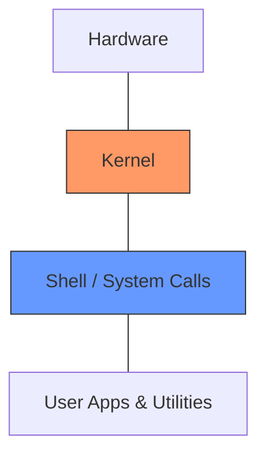

# 🐧 Linux for Cloud DevOps Engineers

> [!NOTE]
> Linux is the backbone of the cloud. Almost every server, container, and cloud service runs on Linux. Understanding its core concepts is essential for any DevOps professional.

## 🏗 Linux Architecture

Linux follows a layered architecture. Think of it like an onion:

---

## 📁 Essential File System Map
| Directory | Content |
| :--- | :--- |
| `/etc` | **Configuration** files (The brain). |
| `/var/log` | **System logs** (Crucial for debugging). |
| `/bin` | **Essential binaries** (ls, cp, etc.). |
| `/tmp` | **Temporary files** (Wiped on reboot). |

---

## 🚀 DevOps Command Cheatsheet

| Command | Why it matters? |
| :--- | :--- |
| `top` / `htop` | Real-time **resource monitoring**. |
| `df -h` | Checking for **disk full** errors. |
| `tail -f` | Monitoring **application logs** live. |
| `netstat -tunlp` | Finding which **port** is being used. |

---

## 💡 Scenario Based Questions

> [!WARNING]
> **Q: A server is slow. What are your first 3 steps?**
> **Ans:** 1. Run `top` to check CPU/Memory. 2. Run `df -h` to check disk space. 3. Check `dmesg` or `/var/log/syslog` for hardware/system errors.

> [!TIP]
> **Q: How to find a file containing a specific string?**
> **Ans:** Use `grep -rnw '/path/' -e 'string'`. This searches recursively, shows line numbers, and matches whole words.

> [!IMPORTANT]
> **Q: What is a Bastion host?**
> **Ans:** A secure server used as a gateway to access private instances within a VPC. It is the only instance with a Public IP allowed to accept SSH connections.

