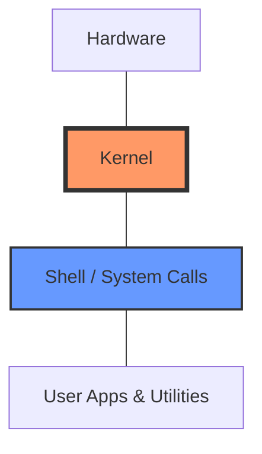

# Linux for Cloud DevOps Engineers

Linux is the backbone of the cloud. Almost every server, container, and cloud service runs on Linux. Understanding its core concepts is essential.

## 🐧 Linux Architecture

Linux follows a layered architecture. Think of it like an onion:

- **Hardware**: The physical machine (CPU, RAM, Disk).
- **Kernel**: The heart of the OS. It talks directly to the hardware and manages resources.
- **Shell**: The interface that takes your commands and gives them to the kernel.
- **Applications**: Tools and utilities you run (like `ls`, `grep`, or your web app).

## 📁 File System Hierarchy

Everything in Linux is a file! The structure looks like an inverted tree:

- `/`: Root directory (The beginning of everything).
- `/bin`: Essential command binaries (like `ls`, `cp`).
- `/etc`: Configuration files for the system.
- `/home`: User home directories.
- `/var`: Variable data (Logs, databases).
- `/tmp`: Temporary files.
- `/root`: Home directory for the superuser (root).

## 🔐 Permissions and Ownership

Linux is built for multiple users, so security is key.

- **r**: Read (4)
- **w**: Write (2)
- **x**: Execute (1)

Each file has permissions for: **User (Owner)**, **Group**, and **Others**.

**Example**: `rw-r--r--` (User can read/write, others can only read).
**Command**: `chmod 755 filename` (Gives full access to owner, read/execute to others).

## 🚀 Common Linux Commands

| Command | Description | Use Case |
|---------|-------------|----------|
| `ls -la` | List all files with details | Checking file permissions |
| `cd` | Change directory | Navigating the system |
| `grep "Error" log.txt` | Search for a string | Debugging application logs |
| `find / -name "*.conf"` | Find a file | Locating a config file |
| `top` / `htop` | Monitor system resources | Checking CPU/RAM usage |
| `df -h` | Check disk space | Checking if disk is full |
| `ps aux` | List running processes | Finding a stuck process |
| `curl` / `wget` | Download files/API calls | Testing connectivity |

## 💡 Scenario Based Questions

**Q1: A user says the server is slow. What is the first thing you check?**
- **Ans**: I would use `top` or `htop` to check high CPU/Memory usage. I would also check `df -h` to see if the disk is full and `iostat` to check for disk I/O bottlenecks.

**Q2: How do you find all files that were modified in the last 24 hours?**
- **Ans**: Use the find command: `find . -mtime -1`

**Q3: How do you see the last 100 lines of a log file in real-time?**
- **Ans**: `tail -f -n 100 /var/log/syslog`

**Q4: How do you find which process is using port 8080?**
- **Ans**: `netstat -tulnp | grep 8080` or `lsof -i :8080`

**Q5: What is a Bastion host?**
- **Ans**: A bastion host is a special-purpose server that acts as a secure gateway to access private servers within a network, usually over SSH.
