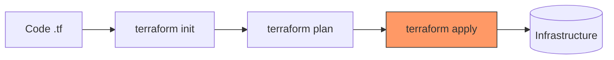

# 🌍 Terraform for Cloud DevOps Engineers

> [!NOTE]
> Terraform is an Infrastructure as Code (IaC) tool that allows you to build, change, and version infrastructure safely and efficiently. It uses HashiCorp Configuration Language (HCL).

## 🚀 The Terraform Lifecycle

Terraform follows a **Declarative** approach. You define the "Desired State", and Terraform makes it happen.



### Key Lifecycle Commands
| Command | Action |
| :--- | :--- |
| `terraform init` | Initializes the working directory and downloads providers. |
| `terraform plan` | Shows the changes that will be made (Dry run). |
| `terraform apply` | Executes the changes to reach the desired state. |
| `terraform destroy` | Removes all managed infrastructure. |

---

## 🛠 Hands-on Proof of Concept (POC)

### Single File Deployment (`main.tf`)
This example creates an **AWS S3 bucket** and an **EC2 instance**.

```hcl
provider "aws" {
  region = "us-east-1"
}

# 📦 S3 Bucket
resource "aws_s3_bucket" "my_bucket" {
  bucket = "my-devops-prep-bucket"
}

# 🖥 EC2 Instance
resource "aws_instance" "my_server" {
  ami           = "ami-0c55b159cbfafe1f0"
  instance_type = "t2.micro"

  tags = {
    Name = "DevOpsPrep-Server"
  }
}

# 📤 Output the result
output "instance_ip" {
  value = aws_instance.my_server.public_ip
}
```

---

## 💡 Scenario Based Questions

> [!IMPORTANT]
> **Q: What is the `terraform.tfstate` file?**
> **Ans:** It is the single source of truth for your infrastructure. It maps your configuration to real-world resources. **Never delete this file!** Store it in a remote backend (like S3) for team collaboration.

> [!WARNING]
> **Q: How to prevent concurrent changes in a team?**
> **Ans:** Use **State Locking**. When using an S3 backend, you can use a **DynamoDB** table to lock the state file during execution.

> [!TIP]
> **Q: How to handle existing resources not managed by Terraform?**
> **Ans:** Use the `terraform import` command to bring existing infrastructure into Terraform management without recreating it.

