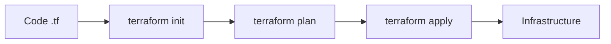

# Terraform for Cloud DevOps Engineers

Terraform is an Infrastructure as Code (IaC) tool that allows you to build, change, and version infrastructure safely and efficiently. It uses HashiCorp Configuration Language (HCL).

## 🌍 How Terraform Works

Terraform follows a declarative approach. You describe the "Desired State" and Terraform makes it happen.

1. **Write**: Define your infrastructure in `.tf` files.
2. **Plan**: Run `terraform plan` to see what changes will be made.
3. **Apply**: Run `terraform apply` to create the infrastructure.

## 🔑 Key Concepts

- **Provider**: A plugin that Terraform uses to talk to a specific cloud (e.g., AWS, Azure, GCP).
- **Resource**: A physical or virtual component that exists in the cloud (e.g., an EC2 instance, an S3 bucket).
- **State File (`terraform.tfstate`)**: A JSON file that keeps track of the infrastructure Terraform managed. **Never delete this!**
- **Variable**: Allows you to parameterize your configurations.
- **Output**: Returns information about your infrastructure (e.g., a Public IP).
- **Module**: A container for multiple resources that are used together.

## 💡 Scenario Based Questions

**Q1: What is the purpose of `terraform.tfstate`?**
- **Ans**: The state file maps your real-world infrastructure to your configuration. It tracks metadata and improves performance for large infrastructures.

**Q2: What is a "Remote Backend"?**
- **Ans**: By default, Terraform stores state locally. In a team environment, you should store it in a remote location like an **AWS S3 bucket** with **DynamoDB** for state locking to prevent multiple people from making changes at the same time.

**Q3: How do you handle secrets in Terraform?**
- **Ans**: Never hardcode secrets. Use environment variables (prefixed with `TF_VAR_`), a `terraform.tfvars` file (which should be in `.gitignore`), or secret managers like AWS Secrets Manager or HashiCorp Vault.

**Q4: What is the difference between `terraform plan` and `terraform apply`?**
- **Ans**: `plan` shows you exactly what Terraform will do without making any changes. `apply` actually executes those changes in the cloud.

**Q5: How do you import existing infrastructure into Terraform?**
- **Ans**: Use the `terraform import` command followed by the resource address and the resource ID from the cloud provider.
